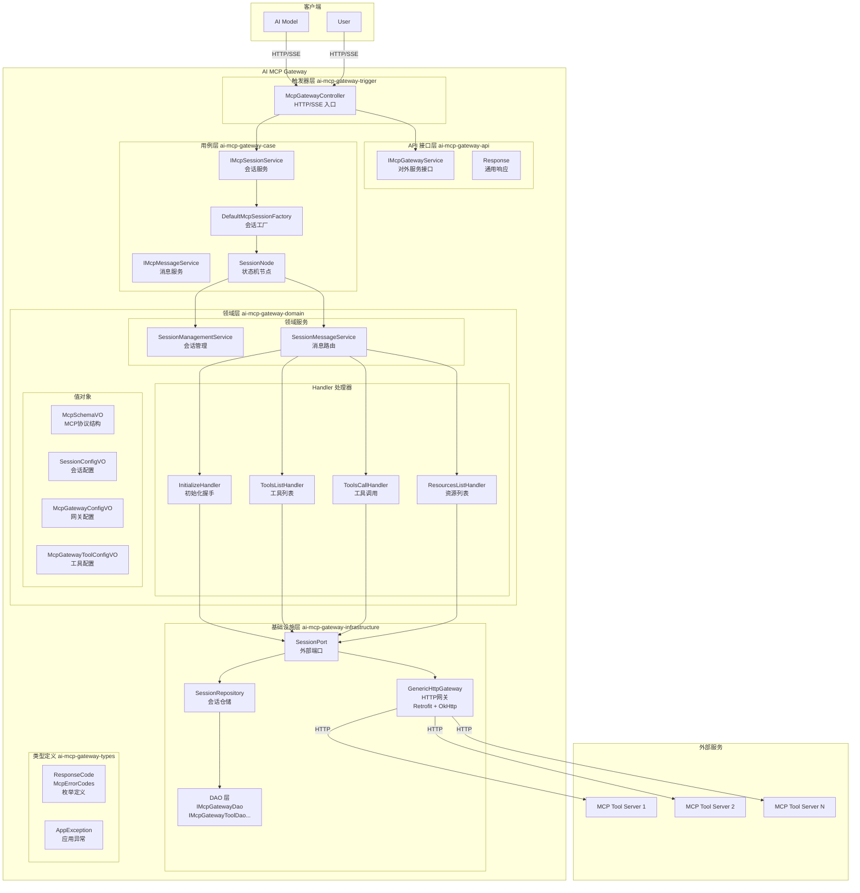
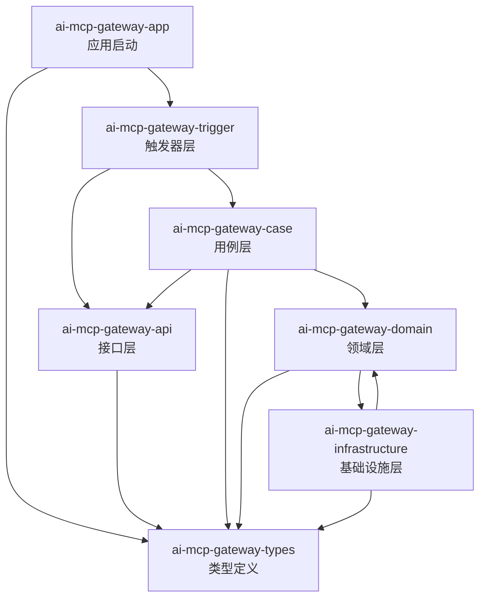
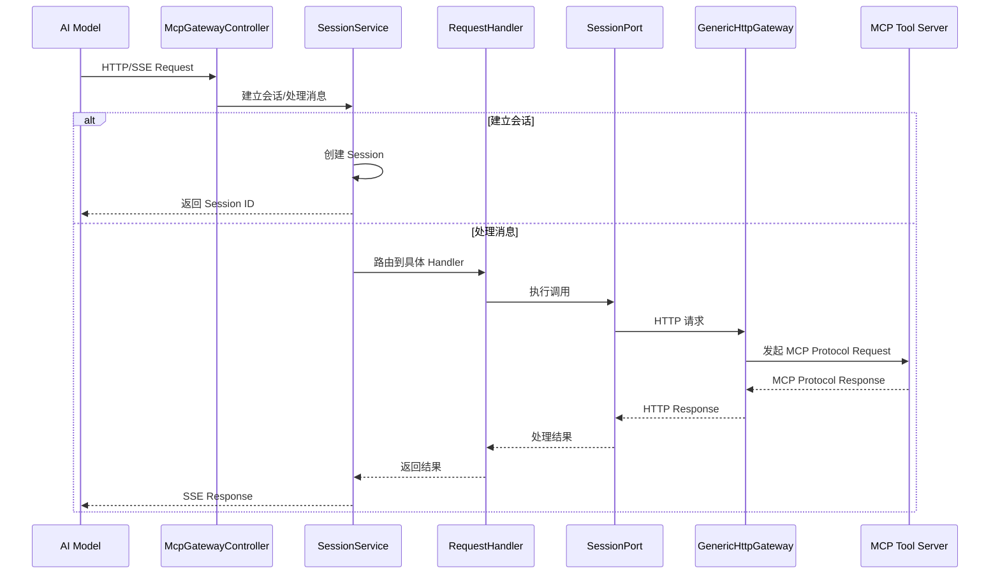

# AI MCP Gateway 架构图

## 项目概述

**AI MCP Gateway** 是一个基于 DDD（领域驱动设计）架构的 MCP (Model Context Protocol) 网关，用于管理和转发 MCP 协议的工具调用请求。

---

## 整体架构图

---

## 模块依赖关系

---

## 数据流图

---

## 技术栈

- **框架**: Spring Boot 3.4.3
- **AI**: Spring AI 1.0.0
- **协议**: MCP (Model Context Protocol) - JSON-RPC 2.0
- **HTTP**: Retrofit 2.9.0 + OkHttp 4.9.3
- **数据库**: MySQL + MyBatis
- **设计框架**: xfg-wrench-starter-design-framework
- **其他**: Guava, FastJSON, JWT

---

## 数据库表

| 表名 | 说明 |
|------|------|
| mcp_gateway | 网关配置表 |
| mcp_gateway_tool | 工具配置表 |
| mcp_gateway_auth | 认证配置表 |
| mcp_protocol_http | HTTP 协议配置表 |
| mcp_protocol_mapping | 协议映射配置表 |
| mcp_protocol_registry | 协议注册表 |
